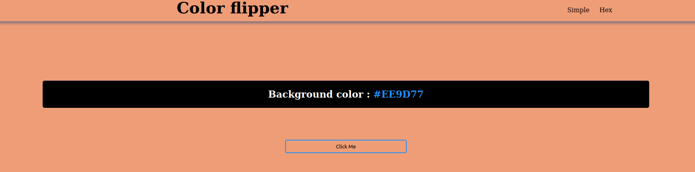

# Background-color

## Table of Contents
- [Background-color](#Background-color)
  - [Table of Contents](#table-of-contents)
    - [General Info](#general-info)
    - [Screenshot](#screenshot)
  - [Technologies](#technologies)
  - [Project status](#project-status)

### General Info
***
Simply code for change the background color on click
### Screenshot

## Technologies
***
Main technologies and libraries
* [JS](https://example.com)
* [HTML](https://example.com)
* [CSS](https://example.com)
